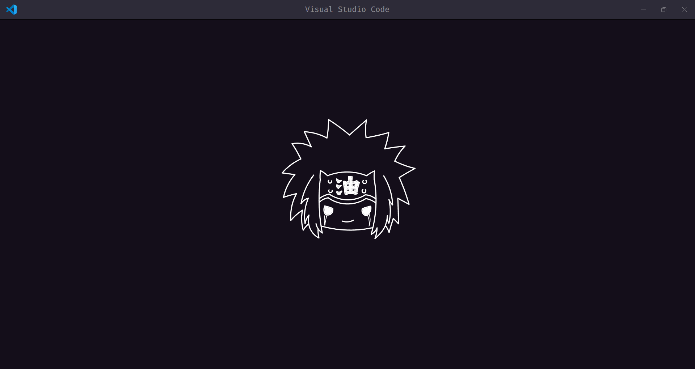
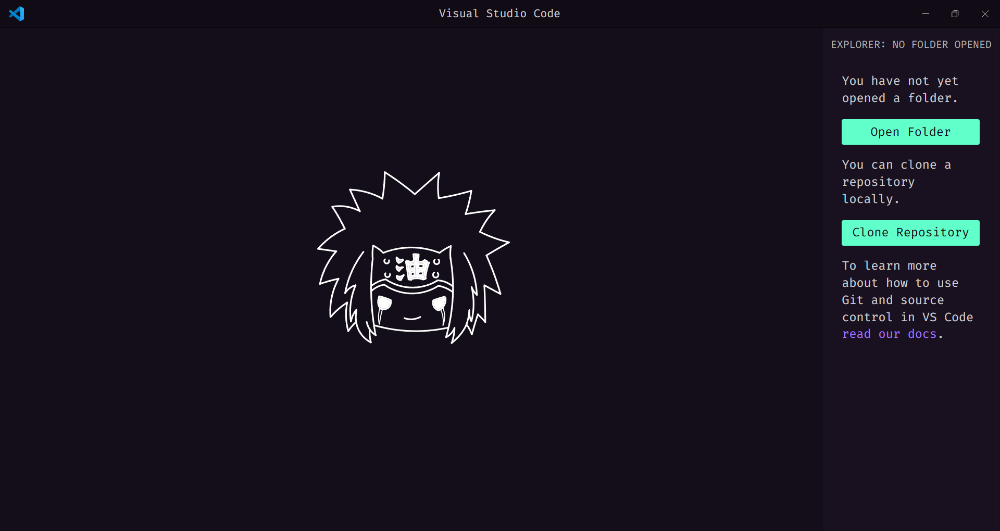
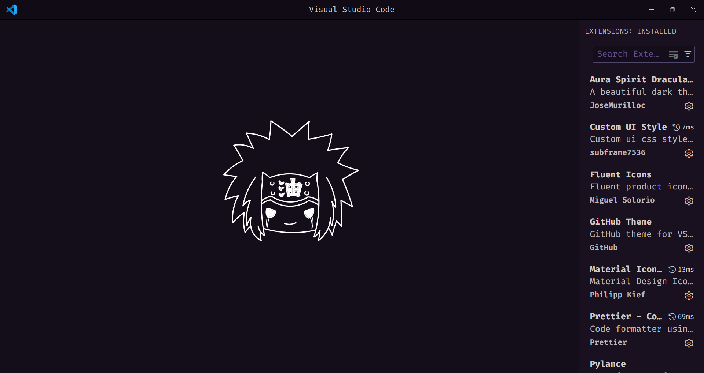
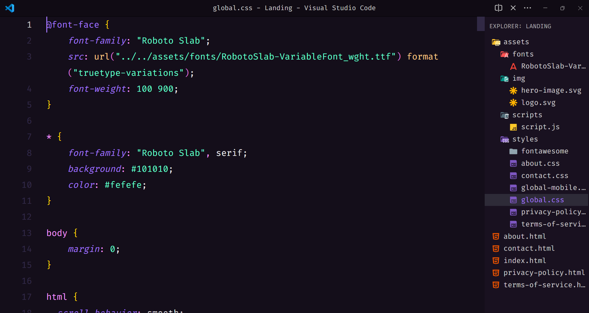
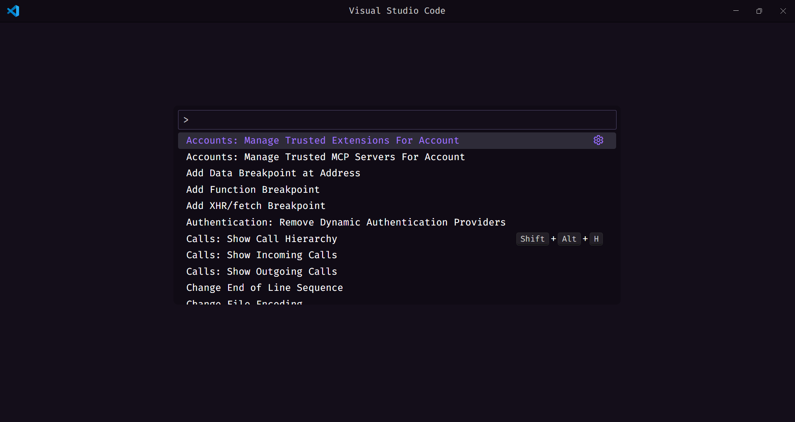

# ✨ My Custom VSCode Theme Setup

<div style="display: flex; gap: 16px; flex-wrap: wrap; justify-content: center;">
  
  
  
  
  
</div>

A clean, modern, and aesthetic Visual Studio Code configuration. Make your editor not just powerful but beautiful.

## 📦 Required VSCode Extensions

Install the following extensions from the VSCode Marketplace:

1. **Aura Spirit Dracula Theme** _by JoseMurilloc_  
2. **Custom UI Style** _by subframe7536_  
3. **Material Icon Theme** _by Philipp Kief_  
4. **Fluent Icons** _by Miguel Solorio_

To install, press `Ctrl + Shift + X` in VSCode and search each extension by name.

## 🎨 Download the Custom CSS

1. Download the file: [`myvscode.css`](./myvscode.css) from this repository.
2. Place it anywhere on your system (e.g. `Documents/themes/myvscode.css`).
3. Copy the full file path.

## ⚙️ Apply the Custom Settings

1. Open the Command Palette with `Ctrl + Shift + P`.
2. Search and select: `Preferences: Open Settings (JSON)`.
3. Replace the contents with [`settings.json`](./settings.json) from this repo.
4. Update the file path for `myvscode.css` in the last line:

   ```json
   "custom-ui-style.external.imports": [
     "file:///C:/Users/YourUsername/Documents/themes/myvscode.css"
   ]

## 💻 Final Steps

1. **Save** the `settings.json` file.
2. Open the Command Palette again with `Ctrl + Shift + P`.
3. Search for: `Custom UI Style: Reload` and run it.
4. **Restart** VSCode.

Enjoy your new look! ✨
